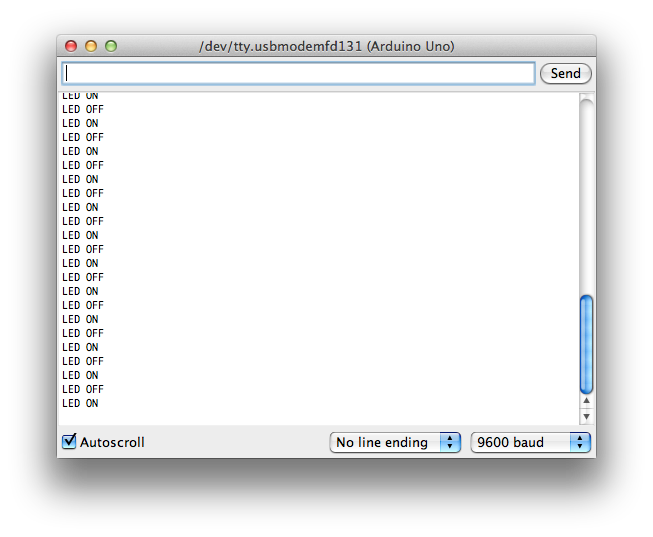

# Example 4

## Overview

Blink an LED attached to digital output 2. 

## Hardware Setup


## Software

```c++
int ledPin = 2;

void setup() {
  // put your setup code here, to run once:
  Serial.begin(9600); 
  Serial.print("Alive\n");
  pinMode(ledPin, OUTPUT);
}

void loop() {
  // put your main code here, to run repeatedly:
  digitalWrite(ledPin, HIGH);
  Serial.print("LED ON\n");
  delay(500);
  digitalWrite(ledPin, LOW);
  Serial.print("LED OFF\n");  
  delay(500);
}
```
[Repository Source](example_4/example_4.ino)

## Output 




## Exploration 

* Rewrite the loop() code so that it includes only one call to digitalWrite in each pass through the loop. The led should still have the behavior of alternating between on and off. 
