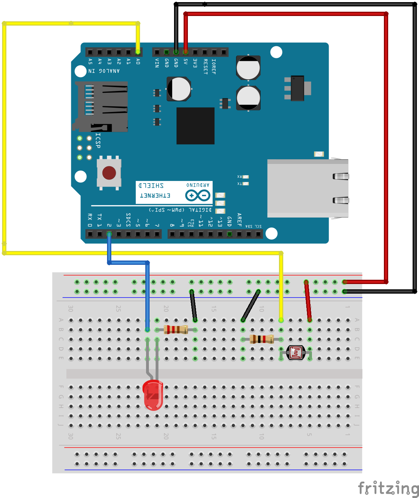
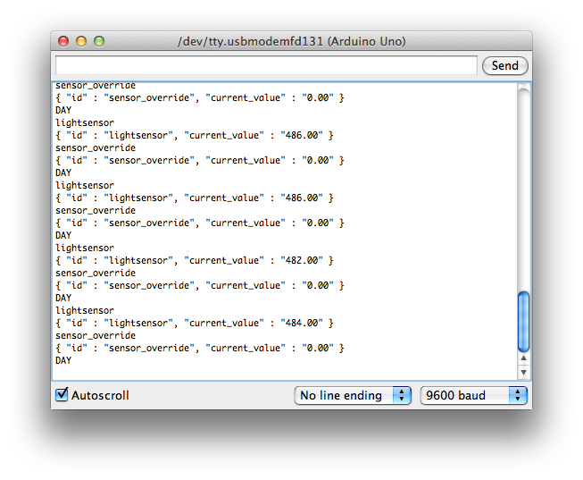

# Example 7

## Overview

Send sensor data to Xively web service to allow data to be graphed. Additionally, add the capability to control the light.

## Library Setup 

This example requires that you copy the **xively** library from the arduino_examples/libraries directory to My Documents/Arduino/libraries folder. **You will need to restart the Arduino program before it will be able to find this library.**

## Xively Web Service Setup

* Create a free Xively developer account at [https://personal.xively.com/signup](https://personal.xively.com/signup). You need to register an email account that will be used in the next step. **Do not reuse a password for this service. Come up with something unique just for this account. You can never be sure how secure web services are in the their handling of password information.**

* Xively will send you an account verification email. You will need to click on the provided link to activate your account.

* Log into your xively account at [https://personal.xively.com](https://personal.xively.com)

* Click on "Add Device" and name it "nightlight". You can also give it a desciption if you would like. Select "Private Device"

* You will be taken to a dashboard page for your device. Add the following channels:
  * lightsensor
  * sensor_override

* You will also need the following variables from the Dashboard when you setup your software:
  * Feed ID
  * API Key 


## Hardware Setup




## Software

```c++
#include <SPI.h>
#include <Ethernet.h>
#include <HttpClient.h>
#include <Xively.h>

// #define GET_FROM_INSTRUCTOR
// #define FEED_ID 
// #define API_KEY " " 

#define THRESHOLD 475
int ledPin = 2;
int sensorPin = A0;

// Your Xively key to let you upload data
char xivelyKey[] = API_KEY;

//datastreams
char lightsensor_feed[] = "lightsensor";
char sensor_override_feed[] = "sensor_override";

XivelyDatastream datastreams[] = {
  XivelyDatastream(lightsensor_feed, strlen(lightsensor_feed), DATASTREAM_FLOAT),
  XivelyDatastream(sensor_override_feed, strlen(sensor_override_feed), DATASTREAM_FLOAT),
};

// Finally, wrap the datastreams into a feed
XivelyFeed feed(FEED_ID, datastreams, 2);
EthernetClient client;
XivelyClient xivelyclient(client);

byte mac[] = { 0xDE, 0xAD, 0xBE, 0xEF, 0xFE, 0xED };
byte ip[] = {129, 79, 243, GET_FROM_INSTRUCTOR};
byte iudns[] = {129, 79, 1, 1};
byte gw[] = {129, 79, 243, 1};

float sensorval = 0.0;

void setup() {
  Serial.begin(9600);  
  Ethernet.begin(mac,ip, iudns, gw);
  pinMode(ledPin, OUTPUT);
  delay(1000);
}

void loop() {
  int getReturn = xivelyclient.get(feed, xivelyKey);    //get data from xively
  if(getReturn > 0){
    Serial.println("lightsensor");
    Serial.println(feed[0]);
    Serial.println("sensor_override");
    Serial.println(feed[1]);
  }
  else { 
    Serial.println("HTTP Error");
  }

 float sensorOverride = datastreams[1].getFloat();
  
  int sensorValue = analogRead(sensorPin);
  datastreams[0].setFloat(sensorValue);
  xivelyclient.put(feed, xivelyKey);
  if (sensorOverride>0.0) {
     digitalWrite(ledPin, HIGH);  
     Serial.print("OVERRIDE ENABLED\n");  
   }
   else if (sensorValue > THRESHOLD) {
     digitalWrite(ledPin, LOW);
     Serial.print("DAY\n");
   }
   else {
     digitalWrite(ledPin, HIGH);
      Serial.print("NIGHT\n"); 
   }
     
   delay(15000);
}
```
[Repository Source](example_7/example_7.ino)

## Output 




## Exploration 

* Try interacting with the override on the xively dashboard. 

